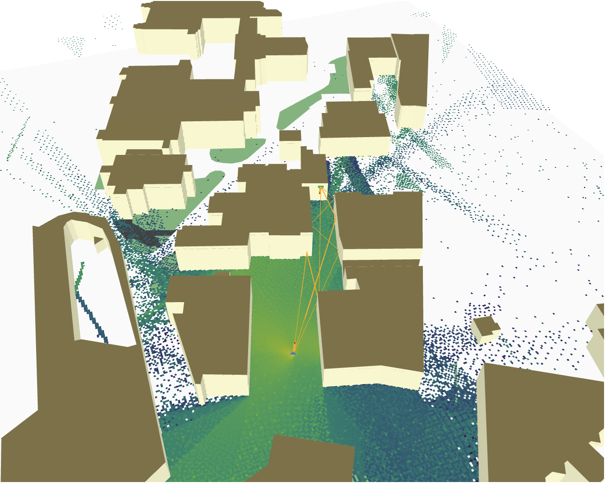

# Generative and Explainable AI for High-Dimensional MIMO-OFDM Channel Estimation in Time-Frequency-Space Domain

_This work is currently under review for publication in the IEEE Transactions on Green Communications and Networking_


# Pipelines
![\[pipelin\]](images/pipeline.png)


# Installation

## Prerequistes
The code use [Sionna](https://jhoydis.github.io/sionna-0.19.2-doc/) library, python version `Python 3.10`.

**Note**: To use `sionna` on macOS, you must install the [LLVM backend](https://drjit.readthedocs.io/en/stable/what.html#backends) to avoid initialization errors

## Setup

```
# Create new conda enviroment
conda create python=3.10 -n cdl
conda activate cdl

# Install requirements
pip install -r requirements.txt

# initial envs
export PYTHONPATH=`pwd`
export DRJIT_LIBLLVM_PATH="/path/to/libLLVM.dylib"
```

<h1 id="simulation">Simulation</h1>

The steps bellow descrice the generate data, training channel estimation.
<h2 id="dataset">Dataset</h2>

Make sure the configuration setting in `src/settings/config.py` are correct before generate the channel dataset for training.

```
python src/ml/gen_data.py
```

**Note**: This script also supports generating datasets using real ray-tracing data.

For more information, see [Real Scenario](#real-scenario)
<h2 id="training">Training</h2>

Make sure the configuration setting in `src/settings/ml.py` are correct before generate the channel dataset for training.
```
python src/ml/train.py
```
<h2 id="eval">Evaluating</h2>
The evaluation metrics are measured at 

- `notebooks/eval.ipynb`: for the CDL Channel data
- `notebooks/eval_rt.ipynb`: for the Real data

<h1 id="notebook">Notebooks</h1>

- `notebooks/statistic_gbsm.ipynb`: statistic the geometric characteristics of CDL channel model.
- `notebooks/statistic_pipeline.ipynb`: statistic the OFDM transmission pipeline and visualize evaluation results
- `notebooks/data.ipynb`: visualize the data information


<h1 id="real-scenario">Real Scenario</h1>




The real scenario is using [OpenStreetMap for Blender](https://github.com/vvoovv/blosm). Follow this [tutorial](https://youtu.be/7xHLDxUaQ7c?si=KA_RlYQsWjNImbGg) to use Sinonna RT + BLOSM and the demo `notebooks/blender.ipynb`. To generate the real data channel, you can follow [dataset](#dataset) but update the channel configuration to use `rt_channel`.


